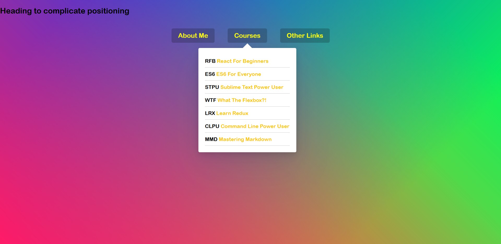

# Stripe Follow Along Dropdown

Download or clone repository and click the index.html file to run.

Replicating Stripe's dropdown menu.

In Stripe's menu the dropdowns are seperate elements but there is a div behind them that follows them around and resizes itself.

The list will be the triggers that will be hovered on. Don't use the anchor link as the trigger or you will move off it every time you try to mouse onto the dropdown.

